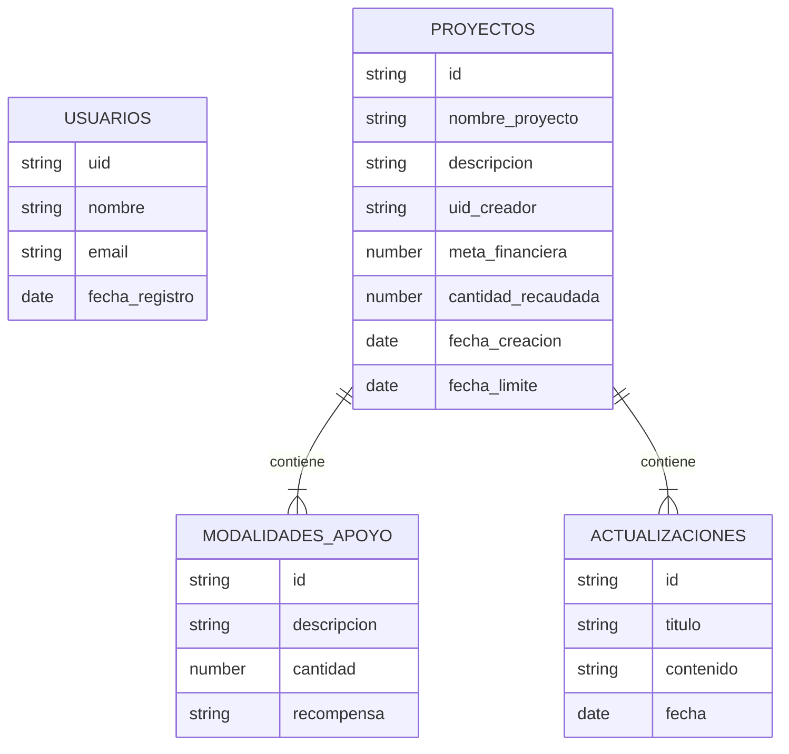

# Ejemplo: Aplicación web de *crowdfunding*

Se pretende desarrollar una aplicación para dar soporte a proyectos financiados con *crowdfunding*. Los usuarios en general podrán ver los proyectos del sitio, apoyarlos con un determinado nivel de recompensa, y ver noticias sobre los mismos. Los creadores de un proyectos podrán editarlo, enviar noticias sobre su progreso, etc...

## Parte 1: Requerimientos 

Los casos de uso básicos son:

* Un usuario sin estar autentificado debe poder ver los datos básicos de la lista de proyectos más populares en el sitio
* Un usuario sin estar autentificado debe poder ver todos los datos de un proyecto,que incluyen también las últimas actualizaciones sobre el mismo.
* Un usuario debe poder hacer login y logout en la aplicación
* Un usuario debe poder darse de alta, editar su perfil y darse de baja
* Un usuario autentificado debe poder elegir una modalidad de apoyo y apoyar un proyecto con esa cantidad
* El usuario que ha creado un proyecto, si está autentificado debe poder gestionar actualizaciones (noticias) sobre el estado del mismo (operaciones: crear, ver, modificar, borrar)
* El usuario que ha creado un proyecto, si está autentificado debe poder gestionar (crear, ver, modificar y borrar) modalidades de apoyo (descripción, cantidad que se pide, recompensa obtenida a cambio...)

## Parte 2: Modelo de datos 

