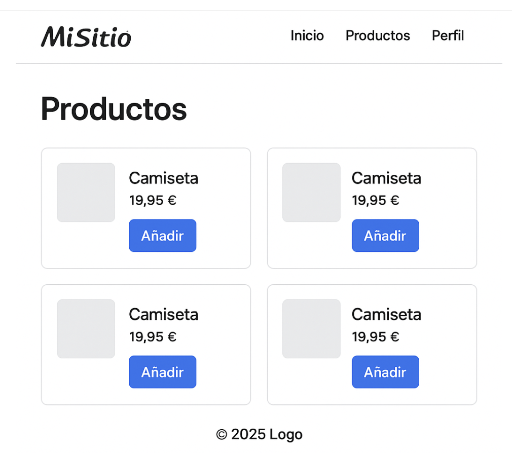

# Práctica 1, parte I: Prototipado de un frontend con HTML/CSS

## 1. Introducción. Idea inicial

Durante las prácticas de la asignatura desarrollaremos el *backend* y el *frontend* de una aplicación web cuya temática queda a vuestra elección. Puede tratar de cualquier tema que se os ocurra: una mini red social para compartir fotos, un sitio de recetas de cocina, un sitio para llevar la pista de las películas/series que has visto y compartir opiniones con otros usuarios,…

Lo primero que deberíais hacer es **plantearos de qué temática queréis desarrollar vuestra app web y haceros un listado de casos de uso**. No es necesario demasiado nivel de detalle. Podéis tomar como modelo [este ejemplo](ejemplo_crowdfunding.html#requerimientos).

**La aplicación debe permitir, como mínimo**

- Que el usuario se autentifique para hacer algunas operaciones
- Crear nuevos elementos (recetas, fotos, películas…), típicamente mediante formularios HTML.
- Buscar elementos (por texto, por género, por categoría… dependerá del tipo de elemento).
- Listar elementos.
- Editar o eliminar elementos.


Aseguraos de que vuestra idea admite un CRUD completo al menos para un par de entidades distintas en vuestro modelo de dominio (por ejemplo, en una web de recetas: usuarios y recetas; en una red social: fotos y publicaciones).

> 📌 En las sucesivas prácticas no será necesario implementar todas las funcionalidades que propongáis ahora. Cada práctica tendrá unos requisitos mínimos para aprobar y otros opcionales para subir nota, pero es posible que aun implementando los opcionales os queden sin implementar funcionalidades que una app real debería tener. Es normal, ya que tenemos un tiempo limitado: lo importante es usar el proceso de desarrollo para aprender, no entregar una app acabada. En resumen: **que hagáis una lista extensísima de casos de uso no significa que os comprometéis a implementarlos todos**, vale más que propongáis "de sobra" a que luego tengáis que pensar casos adicionales.


Una vez escritos los casos de uso deberíais **identificar las entidades que forman parte de vuestro modelo del dominio** (las "cosas" que hay en la aplicación: en una agencia de alquiler de coches habrá usuarios, vehículos, alquileres, ...). Esto nos será muy útil para la parte siguiente de implementación del backend. Podéis hacerlo usando un formato tipo diagrama E-R como [este ejemplo](ejemplo_crowdfunding.html#modelo_datos), o cualquier otro que os parezca adecuado.


## 2. Desarrollo del prototipo

**En la parte I de esta primera práctica implementaremos una versión estática (solo HTML/CSS) del frontend** de la aplicación (sin Javascript). En la parte II de la práctica 1 implementaremos el *backend*, ya veremos con qué plataforma.


> 🧭 Os aconsejo que para ayudaros en el desarrollo del prototipo uséis un LLM tipo ChatGPT, Claude, Gemini,.... En la asignatura no vemos HTML/CSS desde cero por lo que no os voy a pedir que seáis capaces de generar el prototipo sin ayuda, pero sí que entendáis cómo funciona el HTML/CSS generado (aunque necesitéis la ayuda del LLM para explicároslo). Eso quiere decir que mientras entendáis cómo funciona el código me da lo mismo que lo haya escrito íntegramente un LLM. En el examen práctico no pediremos más que HTML básico.


### 2.1 Estructura del HTML

En la actualidad la práctica totalidad de los *frameworks* para desarrollo web *frontend* estructuran el código en *componentes*. Visualmente un componente es una zona de la pantalla con una delimitación clara de "responsabilidades" (una barra de herramientas, una miniatura en la que podemos clicar, un formulario de login,...). Un componente puede estar compuesto a su vez de subcomponentes (por ejemplo los botones de una barra de herramientas). 


> 💡 Como veremos en la asignatura, los *frameworks frontend* nos permiten encapsular por separado el código que forma cada componente: típicamente HTML+CSS+Javascript. De momento solo nos interesa la parte visual (HTML+CSS) y tampoco definiremos por ahora cada componente en un archivo separado, solo marcaremos las secciones del HTML para indicar que en el futuro se separarán en componentes.


#### 2.1.1 Cómo marcar los componentes 

Desde el punto de vista del HTML, un componente no es más que una etiqueta "raíz" que encapsula todo el componente y típicamente contendrá etiquetas hijas. Por ejemplo en una web de recetas podríamos tener el componente `receta` definido simplemente como un `<div>` que contiene toda la información de la receta.

```html
<div>
  
  <h3>Tortilla de patatas</h3>
  <p>Tiempo: 30 min</p>
</div>

```

> ✅ Checklist para decidir "esto es un componente"

> - Se repite (cards, modales, toolbars).
> - Tiene una responsabilidad clara (presenta determinada información, permite realizar una acción, etc.).
> - Te lo imaginas mudándose de página sin romper nada.
> - Podría recibir parámetros para variar la información que muestra o su comportamiento (título, fecha, ...).


**Nos falta marcar en el HTML del prototipo cuáles son las etiquetas raíz de los componentes**, para saber la estructura de la página. Os recomendamos usar un atributo `data-component` aunque discutiremos brevemente otras opciones.

En HTML, los atributos que comienzan por `data-` son aplicables a cualquier etiqueta y definibles por el desarrollador, es decir, lo que viene detrás del `data-` se lo inventa éste. Sirven para almacenar información personalizada en la etiqueta. Por ejemplo en nuestro caso usaremos `data-component="nombre_del_componente"` para especificar que una etiqueta será un componente del frontend.


```html
<div data-component="receta">
  
  <h3>Tortilla de patatas</h3>
  <p>Tiempo: 30 min</p>
</div>

```


> ℹ️ Otro uso típico de `data-` es por ejemplo  guardar el identificador que tiene el objeto en la BD para así poder modificarlo: `<button data-id="42">Borrar receta</button>` (en este ejemplo faltaría el código Javascript que leería el atributo `data-id` y dispararía una petición HTTP al servidor para borrar la receta con id 42). 

También podéis marcar la raíz del componente con una clase CSS especial, aunque se puede confundir con una clase CSS usada para dar estilo visual, por ejemplo:

```html
<div class="component-receta">
  ...
```

Finalmente otra posibilidad es delimitar el componente con comentarios:

```html
<!-- inicio componente receta -->
<div >
  
  <h3>Tortilla de patatas</h3>
  <p>Tiempo: 30 min</p>
</div>
<!-- fin componente receta -->

```

**Os recomendamos que uséis el `data-component`** aunque las otras dos opciones valdrán siempre que seáis consistentes y uséis siempre la misma opción.


#### 2.1.2 Semántica de las etiquetas HTML

Las etiquetas HTML tienen una semántica particular, de modo que **si hay alguna etiqueta apropiada para definir nuestro componente deberíamos usarla. En otro caso típicamente se usa `<div>`**. Por ejemplo en HTML hay una etiqueta `<nav>` para definir barras de navegación, que también es un componente muy típico. En ese caso podríamos definir y marcar el componente de este modo:

```html
<nav data-component="navbar">
  <a href="/">Inicio</a>
  <a href="/recetas">Recetas</a>
  <a href="/perfil">Perfil</a>
</nav>
```

Si tuviéramos un componente que fuera un formulario de login lo típico sería usar `<form>`. En HTML no hay evidentemente ninguna etiqueta pensada para recetas de cocina y por eso hemos usado `<div>` en el ejemplo.

Dicho esto, veréis que en muchos componentes del mundo real se tiende a usar siempre `<div>` como la etiqueta raíz, por ejemplo se usa `<form>` para definir un formulario de login pero se pone dentro de un `<div>`. Esto a veces es por cuestiones de CSS (para poder definir el estilo en el contenedor sin "ensuciar" el `<form>`) y a veces es simplemente por convención.


</aside>	


#### 2.1.3 Layout de páginas y navegación

En las apps web "clásicas" para mostrar información nueva al usuario típicamente debemos cambiar de página, navegando a un HTML nuevo. En las modernas lo normal es mostrar información nueva sin cambiar de página, modificando solo lo que cambia y dejando el resto estático. 

Es muy típico que la app web sea físicamente un único HTML en el que definimos el *layout*: qué partes de la página van a permanecer en un sitio fijo y qué partes van a ir cambiando. En el siguiente ejemplo tendríamos:

- Un componente `SiteHeader` fijo en la parte superior de la página con el logo del sitio y la barra de navegación
- Una zona en el centro de la página que irá mostrando diferentes componentes según naveguemos por la app. Típicamente en frameworks frontend esto se conoce como *outlet* o *view*
- Un componente `SiteFooter` fijo en la parte inferior de la página





Por desgracia este mecanismo de navegación en el que cambia solo una parte de la página típicamente requiere de código Javascript, por lo que de momento tendremos que imitarlo de manera simplificada, repitiendo el layout de la página tantas veces como sea necesario. En el prototipo tendríamos 3 HTML separados: "inicio.html", "productos.html" y "perfil.html", y en "productos.html" tendríamos algo como:

```html
<!doctype html>
<html lang="es">
<head>
  <title>Mi sitio</title>
  <link rel="stylesheet" href="styles.css" />
</head>
<body >
  <header data-component="SiteHeader">
    
    <nav data-component="SiteNavBar">
      <ul>
        <li><a href="inicio.html" data-nav>Inicio</a></li>
        <li><a href="productos.html" data-nav>Productos</a></li>
        <li><a href="perfil.html" data-nav>Perfil</a></li>
      </ul>
    </nav>
  </header>
  <div data-outlet>
    <!-- aquí irán las vistas (que serán componentes), de momento lo ponemos fijo -->
    <section data-component="Productos">
  		<h1>Productos</h1>
  		<ul data-component="ProductList">
    		<li data-component="ProductCard">
      			<a href="producto/camiseta-basica">
        			
        			<h2>Camiseta</h2>
      			</a>
      			<p>19,95 €</p>
      			<button>Añadir</button>
    		</li>
    		...
    	</ul>	
  </div>
  <footer data-component="SiteFooter">
    © 2025 – MiSitio
  </footer>
</body>
</html>
```

Nótese que nos hemos inventado nuevos atributos `data-`:

- `data-outlet` para marcar la sección del HTML como un outlet, donde irán apareciendo distintos componentes en distintos momentos.
- `data-nav` para marcar un enlace indicando que en el futuro no cambiará totalmente de página sino que cambiará solo la parte del outlet.

Cuando usemos el *framework* de *frontend* podremos tener una sola vez el layout de la página principal en "index.html" y la parte que no se repite en los componentes `Productos`, `Inicio` y `Perfil`. Además sustituiremos la etiqueta marcada con `data-outlet` por la etiqueta específica del framework para indicar "outlet" (por ejemplo en Vue se usa `<RouterView>`) y haremos lo propio con los enlaces marcados con `data-nav` (por ejemplo en Vue se usa `<RouterLink>`).


> 

### 2.2 Estructura del CSS

Al igual que en el HTML organizamos la página en componentes, en el CSS necesitamos una estrategia para que los estilos sean fáciles de mantener, reutilizar y leer.

En general, se recomienda usar clases para aplicar estilos.

```css
/* En el css */
.boton-primario {background: blue; color: white;}
```

```html
<!-- en el HTML -->
<button class="boton-primario">Añadir</button>
```

Hay varias convenciones útiles para que las clases no se conviertan en un caos. Vamos a comentar dos muy extendidas: BEM y "estilo Tailwind"

**BEM (Block-Element-Modifier)** es un estilo de nombrado de clases CSS muy usado en proyectos grandes. La idea es dividir el nombre de una clase en bloque, elemento y modificador:

```css
.card { /* bloque */ }
.card__title { /* elemento dentro de card */ }
.card--destacado { /* variante (modificador) */ }
```

La ventaja principal es que los nombres son autoexplicativos, es fácil ver qué pertenece a qué componente.
Como inconveniente los nombres pueden resultar largos.

Aquí tenéis el ejemplo de la lista de productos (camisetas) que teníamos antes añadiendo clases BEM

```html

<section data-component="Productos" class="product-list">
  <h1 class="product-list__title">Productos</h1>
  <ul class="product-list__items" data-component="ProductList">
    <li class="product-card" data-component="ProductCard">
      <a href="producto/camiseta-basica" class="product-card__link">
        
        <h2 class="product-card__title">Camiseta</h2>
      </a>
      <p class="product-card__price">19,95 €</p>
      <button class="product-card__button">Añadir</button>
    </li>

    <li class="product-card product-card--featured">
      <!-- aquí vendrían las propiedades del producto, omitimos para abreviar -->
    </li>

  </ul>
</section>

```

En lo que podríamos llamar **"estilo Tailwind"**, porque ha sido popularizado por la herramienta del mismo nombre, las clases no describen un componente, sino propiedades concretas:

```html
<button class="p-2 bg-blue-500 text-white rounded">Comprar</button>
```

Tailwind proporciona las definiciones de estilos CSS para todas estas clases (aunque podríamos hacerlas nosotros mismos). Por ejemplo en tailwind se define la regla CSS para la clase `rounded` como `.rounded { border-radius: 0.25rem; /* 4px */ }`

La ventaja de esta convención es que es rápida e intuitiva a la hora de ir ajustando el diseño visual, el inconveniente es que el HTML se llena de clases CSS.

**Podéis usar la convención que queráis siempre que sea "estándar" como las dos que hemos explicado**. Hay otras convenciones que no hemos comentado como OOCSS o SMACSS.

## 3. Entrega y baremo de evaluación

El prototipo HTML/CSS se puede entregar **hasta el 29 de septiembre a las 23:59**. La entrega se realizará por moodle, comprimiendo todos los archivos en un único .zip o similar. 

La implementación del backend se entregará con posterioridad a esta fecha (ya se fijará el plazo) aunque tanto el prototipo HTML/CSS como el backend se puntuarán como una única práctica (el prototipo valdrá 3 puntos y el backend 7)

Junto con el HTML/CSS se debería entregar una breve **documentación** (1 punto de los 3 con que se valora esta entrega) que incluya:

- **Un máximo de 1-2 páginas** explicando “de qué va” la aplicación web que queréis desarrollar y la lista de casos de uso. 
- **El diagrama del modelo del dominio**
- Siempre que uséis un LLM **deberíais incluir un log con los prompts usados** (para abreviar no es necesario que incluyáis las respuestas completas del LLM)
- **Un video entre 2 y 4 minutos de duración** tipo *screencast* en el que los dos componentes del grupo  expliquéis al 50% la estructura del HTML y CSS del prototipo: cuál es la estructura de la página (componentes en el HTML) y cómo se consigue la apariencia en el CSS (el layout y el estilo visual). Al 50% significa que deberíais hablar aproximadamente la mitad del tiempo cada uno. No necesariamente se puntuarán más los videos más largos, siempre que esté todo explicado correctamente.

