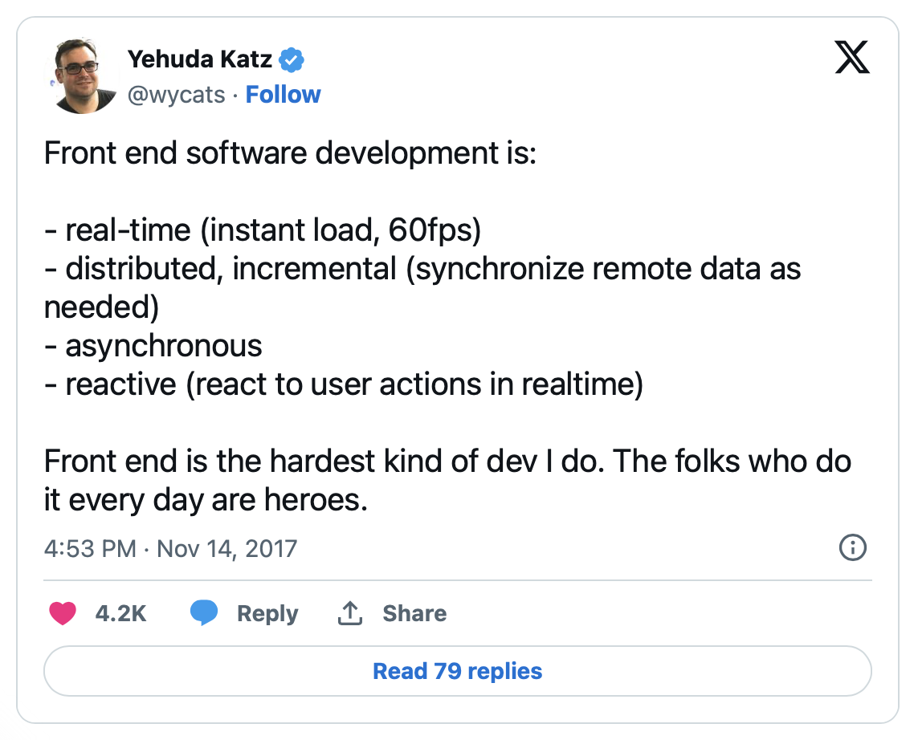
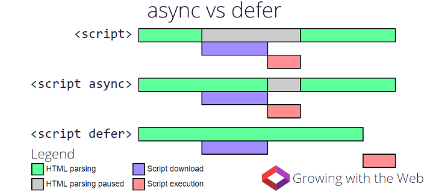
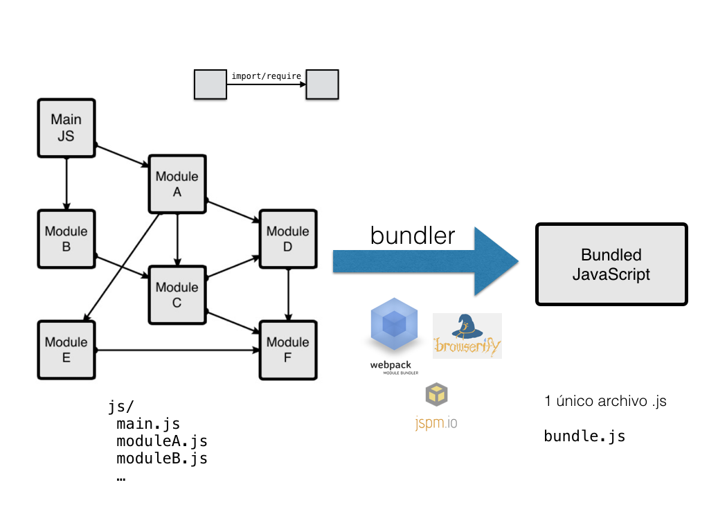

<!-- .slide: class="titulo" -->

# Tema 4: Javascript en clientes web: 
## Parte I: introducción, eventos y API del DOM


---

<!-- .slide: class="titulo" -->


## Javascript en el cliente: conceptos básicos

---

En el principio Javascript y el desarrollo *frontend* era **esto**


```html
<h1>Mi web</h1>
<script>
  alert("¡¡Bienvenido a mi web!!")
</script>
```

La web de los 90s: [https://sophieswebsite1999.neocities.org/](https://sophieswebsite1999.neocities.org/)

---

Pero el desarrollo *frontend* actual no es trivial




[https://x.com/wycats/status/930463710941872128?s=20](https://x.com/wycats/status/930463710941872128?s=20)

---

## Versiones de JS en el navegador

Javascript (también llamado ECMAScript o ES) es un lenguaje en rápida evolución

- La última gran "revolución" en JS fue ES2015, a.k.a. ES6
- Cada año hay un nuevo estándar: ES2021, ES2022,...
- Importa el [soporte de funcionalidades](https://caniuse.com/?search=ecmascript) más que de versiones


---

## Transpilación

- Si el navegador objetivo no soporta las funcionalidades que necesitamos se pueden usar compiladores ([*transpiladores*](https://en.wikipedia.org/wiki/Source-to-source_compiler)) que **traduzcan de las versiones nuevas de Javascript a código más antiguo** 
- El transpilador más usado actualmente es [**Babel**](https://babeljs.io/)
- Se empezaron a usar para transformar ES6->ES5, en general ya no necesario. Se sigue usando para dar soporte a navegadores *legacy* y para poder emplear funcionalidades recientes 
- También se usa para traducir otros formatos a JS [como .jsx](https://babeljs.io/docs/en/babel-plugin-transform-react-jsx), propio de React

---


Como curiosidad: Babel lo empezó a escribir Sebastian McKenzie a los 17 años mientras estaba en el instituto. Podéis leer [la historia de esta época](https://medium.com/@sebmck/2015-in-review-51ac7035e272#.1vfchy3bc) contada por él mismo.

---

## Insertar JS en el HTML

- En etiquetas `<script>`
- El ámbito de las variables y funciones definidas es la *página*
- Por defecto el JS se *parsea* y ejecuta conforme se va leyendo

```html
<html>
<head>
  <script>   
    //esto define la función pero no la llama todavía
    function ahora() {            
       var h = new Date();    
       return h.toLocaleString(); }
    var verFecha = true;
   </script>
   <!-- podemos cargar JS externo con un tag vacío y su URL en el src -->
   <script src="otroscript.js"></script>
</head>
<body>
   <script>
      //la variable es visible por estar definida antes en la misma página
      if (verFecha)
        alert("Fecha y hora: " + ahora());
   </script>
</body>
</html>
```

---

## Carga de *scripts* externos

Forma "clásica": con el atributo `src` en un `<script>` vacío conseguimos una especie de "include". Todo lo que incluímos está en el mismo "espacio de nombres"

```html
<!-- Ejemplo completo en https://jsbin.com/wiyocat/edit?html,js,output -->
<script src="https://threejs.org/build/three.js"></script>
<script>
    // Crear una escena
    var scene = new THREE.Scene();
    // Crear una cámara
    var camera = new THREE.PerspectiveCamera(75, window.innerWidth/window.innerHeight, 0.1, 1000);
    //... el ejemplo continúa...
</script>
```
- Típicamente cada `<script src="">` define una o más clases, funciones o vars. que son **globales**
- Con muchas dependencias externas, esta forma se vuelve tediosa (por la cantidad de `script src`) y problemática (por colisiones en los nombres o tener que gestionar el orden de las dependencias, si hay relaciones entre ellas)


---

Por defecto al encontrar un *script* se interrumpe la carga del HTML hasta que se acabe de cargar,_parsear_ y ejecutar el *script*. Por ello típicamente __se recomendaba colocar los scripts al final__, así el usuario no ve una página en blanco. 

Con *scripts* externos podemos usar los atributos `defer` o `async` 

[https://www.growingwiththeweb.com/2014/02/async-vs-defer-attributes.html](https://www.growingwiththeweb.com/2014/02/async-vs-defer-attributes.html)
<!-- .element class="caption"-->




---

## Módulos en JS

Claramente, los `<script src="">` no son una buena solución al **problema de la modularidad**, ya que lo único que estamos haciendo es juntar todo el código en un "espacio global".

En JS han ido surgiendo distintos sistemas de módulos, algunos estándares oficiales y otros "de facto", en la actualidad quedan

- **CommonJS** (originario de Node)
- **Módulos ES6 o ESM** (diseñados para los navegadores, también en Node desde 2020)  

---

## Módulos CommonJS

```javascript
//Archivo "modulo_saludo.js"
function saludar(nombre) {
    return "Hola qué tal, " +  nombre
}
  
module.exports =  saludar
```

```javascript
//Archivo que hace uso de "modulo_saludo"
let s = require('./modulo_saludo')
console.log(s("Pepe"))
```

---

## Módulos ESM


```javascript
//archivo modulo_saludo.js
function saludar(nombre) {
  return "Hola qué tal, " +  nombre
}
export {saludar}
```

```javascript
//archivo main.js (hace uso del modulo_saludo)
import {saludar} from './modulo_saludo.js'
console.log(saludar('Pepe'))
```

Hay muchas formas de [import](https://developer.mozilla.org/es/docs/Web/JavaScript/Reference/Statements/import)<br>


```html
<!-- en el HTML -->
<script type="module" src="main.js"></script>
```


---

## Un problema de los módulos ESM

- Aunque a fecha de hoy todos los navegadores [los implementan](https://caniuse.com/#search=modules), esto es relativamente reciente (desde 2018). **La necesidad de usar módulos en *frontend* surgió antes de que ESM se implementara en los navegadores más usados**
- A alguien se le ocurrió que se podía añadir soporte de CommonJS al navegador con una herramienta externa que "transformara" el módulo en algo que se pueda incluir con un `script src=""` (esta herramienta se llamó *bundler*)
- Como resultado, desde hace unos años **muchas dependencias de terceros se distribuyen** con `npm`, **en** formato **CommonJS** (no soportado nativamente por los navegadores)


---

## Bundlers

- Herramientas que a partir de un conjunto de módulos resuelven las dependencias y **concatenan todo el código en un único .js (*bundle*)** que el navegador puede cargar con un simple `<script src="">`
- Típicamente ofrecen compatibilidad con módulos ESM y CommonJS
- Además el *bundler* puede realizar operaciones adicionales como:
  * Llamar a un transpilador para traducir el código de ES6 a ES5
  * *minificar* el código
  * copiar los *assets* (jpg, png, ...)
  * ...
- Ejemplos: webpack, vite, parcel, rollup, esbuild ...
- Veremos su uso en prácticas


---




---

## ¿Siguen siendo necesarios los *bundlers* en el 2025?

- Teóricamente no deberían, ya que todos los navegadores soportan ESM
- Pero...
    + En producción es más eficiente descargar un solo *bundle* que muchos módulos separados (demasiadas peticiones HTTP)
    + Además del *bundle* realizan otras muchas tareas
- Hay *bundlers* modernos, como [Vite](https://vitejs.dev/), que generan *bundles* compatibles con ESM


---

## Acceso a los APIs nativos del navegador

- El navegador incluye "de serie" multitud de APIs, para: gestión de eventos, manipulación del HTML, comunicación con el servidor, guardar datos en local, dibujar gráficos,...
- Hay una serie de "objetos globales predefinidos" de los que "cuelgan" estos APIs, por ejemplo
  + `window`: el objeto global por defecto, todo lo que definimos está dentro de él.
  + `document`: la página actual
  + `navigator`: el navegador


---


Vamos a ver a continuación con más detalle los **APIs estándar** que nos permiten programar **con JS en el navegador**. Para que sea un poco más llevadero, lo haremos en forma de *demo*

---

<!-- .slide: data-background-image="images_intro/owen-wow.jpg" -->

---


<iframe src="https://www.youtube.com/embed/dn5Tattkj_E" title="YouTube video player" frameborder="0" allow="accelerometer; autoplay; clipboard-write; encrypted-media; gyroscope; picture-in-picture" allowfullscreen class="r-stretch"></iframe>


- API: https://owen-wilson-wow-api.onrender.com/

- Plantilla de ejemplo: [https://stackblitz.com/edit/vitejs-vite-vykgjp](https://stackblitz.com/edit/vitejs-vite-vykgjp)

---
<!-- .slide: class="titulo" -->


## Acceso al HTML y manipulación del contenido: el API DOM

---

**DOM** (*Document Object Model*): por cada etiqueta o componente del HTML actual hay en memoria un objeto Javascript equivalente. 

Los objetos JS forman un árbol en memoria, de modo que un nodo del árbol es "hijo" de otro si el elemento HTML correspondiente está *dentro* del otro.

**API DOM**: conjunto de APIs que nos permite acceder al DOM y manipularlo. Al manipular los objetos JS estamos cambiando indirectamente el HTML *en vivo* 


---

## El árbol del DOM

[Live DOM Viewer](https://software.hixie.ch/utilities/js/live-dom-viewer/?%20%3C!DOCTYPE%20html%3E%0A%3Chtml%3E%0A%3Chead%3E%0A%3Ctitle%3EEjemplo%20de%20DOM%3C%2Ftitle%3E%0A%3C%2Fhead%3E%0A%3Cbody%3E%0A%3C!--%20es%20un%20ejemplo%20un%20poco%20simple%20--%3E%0A%3Cp%20style%3D“color%3Ared”%3EBienvenidos%20al%20%3Cb%3EDOM%3C%2Fb%3E%3C%2Fp%3E%0A%3C%2Fbody%3E%0A%3C%2Fhtml%3E)


---
