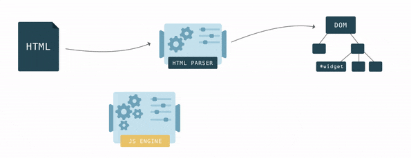
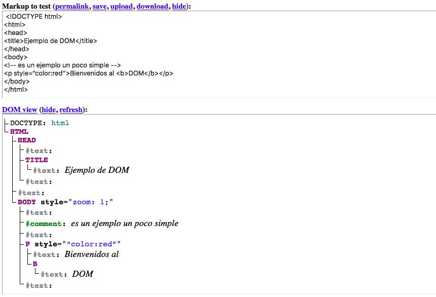

<!-- .slide: class="titulo" -->

## Eventos

### Eventos y *listeners*

- Casi todo el código Javascript incluido en un HTML se va a ejecutar de modo ***asíncrono***, en respuesta a **eventos**
- Los eventos pueden responder directamente a *acciones* del usuario (p.ej. `click` con el ratón) o bien a *sucesos* "externos" (p. ej. la página ha acabado de cargarse). 
- A **cada evento le podemos asociar una o más funciones JS** que se ejecutarán cuando se dispare. Genéricamente esto se conoce como *callbacks*. En el contexto de eventos, son llamados *listeners* 

### Definir un listener

con `addEventListener` se añade un *listener* que responde a un *evento* sobre un *elemento* del HTML

- Cada evento tiene un [nombre estándar](https://developer.mozilla.org/en-US/docs/Web/Events/keydown): 'click', 'mouseover', 'load', 'change'
- Algunos eventos son aplicables prácticamente a cualquier elemento HTML ('click', 'mouseover'). Otros solo a algunos ('change' o 'keydown' solo a campos de entrada de datos)
- Un mismo elemento y evento pueden tener asociados **varios *listener***

### Ejemplo de *listener*

HTML:

```html
<button id="miBoton">¡No me pulses!</button>
```

JS:

```javascript
//El listener recibirá automáticamente un objeto Event con info sobre el evento
//https://developer.mozilla.org/en-US/docs/Web/API/Event
function miListener(evento) {
    alert('Te dije que no lo hicieras!, pero has clicado en '
          + evento.clientX + ',' + evento.clientY)
}
var boton = document.getElementById('miBoton')
//cuando se haga click sobre el objeto "boton", se llamará a "miListener"
boton.addEventListener('click', miListener)
//Otra forma: definimos el listener como una función anónima
boton.addEventListener('click', function() {
   console.log('no espíes la terminal ehhh')
})
```

[https://jsbin.com/funizen/edit?html,js,output](https://jsbin.com/funizen/edit?html,js,output)


### Delegación de eventos

Los eventos sobre una etiqueta HTML *suben*  hacia arriba en la jerarquía de etiquetas (*bubbling up*), de modo que podemos capturarlos también en niveles superiores.

```html
<div id="outer" style="padding: 20px; background: lightblue">
  Outer
  <div id="inner" style="padding: 20px; background: lightgreen">
    Inner
    <button id="boton">Botón</button>
  </div>
</div> 
```
```javascript
document.getElementById("outer").addEventListener('click', () => console.log('outer bubbling'))
document.getElementById("inner").addEventListener('click', () => console.log('inner bubbling'))
document.getElementById("boton").addEventListener('click', () => console.log('boton bubbling'))
```
[https://jsbin.com/hohacirali/edit?html,js,console,output](https://jsbin.com/hohacirali/edit?html,js,console,output)<!-- .element class="caption" -->


La delegación de eventos es útil cuando queremos asignar un comportamiento similar a varios elementos sin tener que repetir el *event listener* para cada uno 

[Ejemplo "teclado simulado"](https://jsbin.com/yutame/edit?html,js,output)


### Eventos que no dependen del usuario

- Evento `DOMContentLoaded` (sobre `document`): indica que se ha parseado y cargado completamente el HTML
- Evento `load` (sobre `window`, `document` o `script`): indica que se ha cargado completamente un recurso y sus dependientes (por ejemplo si es sobre `window` no solo el HTML sino también los *scripts*, imágenes)


```javascript
document.addEventListener('DOMContentLoaded', function() {
  alert("Ahora ya puedo marearte con este bonito anuncio")
})
```


### Event handlers

Forma *legacy* de definir *listeners*.  Además de la sintaxis, la diferencia principal es que __solo puede haber un handler__ para un evento y un elemento HTML dados

Los *handler* tienen como nombre 'onXXX', donde 'XXX' es el nombre del evento: 'onclick', 'onmouseover', 'onload',...


### Ejemplo de *handler*

HTML:

```html
<button id="miBoton">¡No me pulses!</button>
```

JS:

```javascript
var boton = document.getElementById('miBoton')
boton.onclick = function() {
    console.log('has hecho click')
} 
//CUIDADO, este handler SUSTITUIRÁ al anterior!!!
boton.onclick = function() {
    alert('has hecho click')
} 
```


### Manejadores de evento *inline*

La forma más antigua de definir *handlers*: en el propio HTML, con un atributo `onXXX`:

```html
<!-- nótese que decimos que hay que INVOCAR la función, y no la
  referenciamos simplemente como hasta ahora. Esto es porque aquí 
  podemos poner código arbitrario. Pero un listener debía ser una función -->
<button onclick="mensaje()">¡No me pulses!</button>
```

```javascript
function mensaje() {
   console.log('mira que eres pesadito/a')
}
```

Tiene "mala prensa" porque mezcla JS y HTML. Curiosamente en los *frameworks* web modernos se tiende a usar esta forma de programar 🤯.


## Acceso al HTML y manipulación del contenido: el API DOM


**DOM** (*Document Object Model*): por cada etiqueta o componente del HTML actual hay en memoria un objeto Javascript equivalente. 

Los objetos JS forman un árbol en memoria, de modo que un nodo del árbol es "hijo" de otro si el elemento HTML correspondiente está *dentro* del otro.

**API DOM**: conjunto de APIs que nos permite acceder al DOM y manipularlo. Al manipular los objetos JS estamos cambiando indirectamente el HTML *en vivo* 




### El árbol del DOM

[Live DOM Viewer](https://software.hixie.ch/utilities/js/live-dom-viewer/?%20%3C!DOCTYPE%20html%3E%0A%3Chtml%3E%0A%3Chead%3E%0A%3Ctitle%3EEjemplo%20de%20DOM%3C%2Ftitle%3E%0A%3C%2Fhead%3E%0A%3Cbody%3E%0A%3C!--%20es%20un%20ejemplo%20un%20poco%20simple%20--%3E%0A%3Cp%20style%3D“color%3Ared”%3EBienvenidos%20al%20%3Cb%3EDOM%3C%2Fb%3E%3C%2Fp%3E%0A%3C%2Fbody%3E%0A%3C%2Fhtml%3E)




### Acceder a un nodo

**Por `id`**. "marcamos" con un `id` determinado aquellas partes de la página que luego queremos manipular dinámicamente

```javascript
var noticias = document.getElementById("noticias")
```

**Por etiqueta**: accedemos a todas las etiquetas de determinado tipo

```javascript
//Ejemplo: reducir el tamaño de todas las imágenes a la mitad
//getElementsByTagName devuelve un array
var imags = document.getElementsByTagName("img"); 
for(var i=0; i<imags.length; i++){
      //por cada atributo HTML hay una propiedad JS equivalente
      imags[i].width /= 2;
      imags[i].height /= 2;
}
```

Con [**selectores CSS**](https://developer.mozilla.org/es/docs/Web/CSS/Introducción/Selectors):

```javascript
//querySelector: obtener el 1er nodo que cumple la condición
//este ejemplo sería equivalente a getElementById
var noticias = document.querySelector('#noticias')
//aunque puede haber varios divs solo obtendremos el 1o
var primero = document.querySelector("div");
//querySelectorAll: obtenerlos todos (en un array)
var nodos = document.querySelectorAll("div");
//Cambiamos la clase. Nótese que el atributo es “className”, no “class”
//al ser "class" una palabra reservada en JS
for (var i=0; i<nodos.length; i++) {
    nodos[i].className = "destacado";
}
//selectores un poco más complicados
var camposTexto = document.querySelectorAll('input[type="text"]');
var filasPares = document. querySelectorAll("tr:nth-child(2n)")
```

### "Datos básicos" de un nodo

En un nodo tenemos su nombre (`nodeName`) y su valor (`nodeValue`)

- Para las etiquetas, el nombre es la etiqueta en mayúsculas y sin `< >` y el valor `null`
- Para los nodos de texto, el nombre siempre es `#text` y el valor su contenido
- En los campos de formulario editables, el contenido no está en `nodeValue` sino en `value` 


### Relaciones "familiares" entre nodos

Una vez accedemos a un nodo podemos acceder a su "padre", "hijos" o "hermanos" con una serie de propiedades:

- Padre: `parentNode`
- Hijos 
  -  Solo los *tags*: array `children`. Primero=>`firstElementChild`, último=> `lastElementChild` 
  -  Todos (incl. *whitespace nodes*): array `childNodes`. Primero=>`firstChild`, Último=>`lastChild` 
- Hermanos:
  - Solo los *tags*: siguiente `nextElementSibling`, anterior `previousElementSibling`
  - Todos (incl. *whitespace nodes*): `nextSibling`, `previousSibling`


### Añadir/eliminar/crear nodos

La idea de poder añadir/eliminar/crear nodos para que cambie el HTML es muy **potente**, pero el API es **tedioso** de utilizar

```javascript
<input type="button" value="Añadir párrafo" id="boton"/>
<div id="texto"></div>
<script>
 document.getElementById("boton").addEventListener('click', function() {
   var texto = prompt("Introduce un texto para convertirlo en párrafo");
   /* Nótese que la etiqueta <p> es un nodo, y el texto que contiene es OTRO 
      nodo, de tipo textNode,  hijo del nodo <p> */
   var par = document.createElement("P");
   var nodoTexto = document.createTextNode(texto);
   par.appendChild(nodoTexto);
   document.getElementById('texto').appendChild(par);
 })
</script>
```

[http://jsbin.com/gaxehayeni/edit?html,js,output](http://jsbin.com/gaxehayeni/edit?html,js,output)


### Manipular directamente el HTML

Insertar/eliminar directamente una **cadena HTML** en determinado punto (internamente se siguen añadiendo/eliminando nodos como antes, pero ahora es automático) 

`innerHTML`:  propiedad de lectura/escritura que refleja el HTML dentro de una etiqueta.

```javascript
<input type="button" value="Pon texto" id="boton"/>
<div id="texto"></div>
<script>
 document.getElementById("boton").addEventListener('click', function() {
    var mensaje = prompt("Dame un texto y lo haré un párrafo")
    var miDiv = document.getElementById("texto")
    miDiv.innerHTML += "<p>" + mensaje + "</p>"  
 })
</script>
```

Nótese que el `+=` de este ejemplo es ineficiente, ya que estamos *reevaluando* el HTML ya existente


### Insertar directamente HTML

`insertAdjacentHTML(posicion, cadena_HTML)`: método llamado por un nodo, inserta HTML en una posición relativa a él.  `posicion` es una cte. con posibles valores  `"beforebegin"`, `"afterbegin"`, `"beforeend"`, `"afterend"` 

```html
<div id="texto">Hola </div>
<button id="boton">Añadir</button>
```

```javascript
document.getElementById("boton").addEventListener('click', function() {
   var nodoTexto = document.getElementById("texto");
  nodoTexto.insertAdjacentHTML("beforeend", "<b>mundo</b>");
  nodoTexto.insertAdjacentHTML("afterend", "<div>más texto</div>");
})
```

[http://jsbin.com/romewolidi/edit?html,output](http://jsbin.com/romewolidi/edit?html,output)

### Uso directo del DOM vs Frameworks Javascript

La mayoría de *frameworks Javascript* nos liberan de la necesidad de modificar el DOM directamente

- En algunos podemos **vincular**  elementos HTML con partes del modelo, de manera que se **actualicen automáticamente** (*binding*). Ejemplos: Knockout, Angular, Svelte...
- En otros simplemente **especificamos el HTML deseado** y el *framework* se encarga de modificar solo las partes que cambian. Por ejemplo React, Vue,...

Lo veremos con detalle en el tema siguiente, de momento un ejemplo sencillo con el framework Vue:

[https://jsbin.com/nahikon/edit?html,js,output](https://jsbin.com/nahikon/edit?html,js,output) <!-- .element: class="caption" -->

```html
<div id="app">
  Tu nombre: <input type="text" v-model="nombre"><br>
  <button v-on:click="generarPuesto">Generar puesto</button>
  <div class="tarjeta">
      {{nombre}} <br> {{puesto}}
  </div>  
</div>    
```
 
```javascript
var app = new Vue({
   el:'#app',
   data: {
     nombre: "",
     puesto: ""
   },
   methods: {
     generarPuesto: function() {
       this.puesto = faker.name.jobTitle()
     }
   }
 })
```
