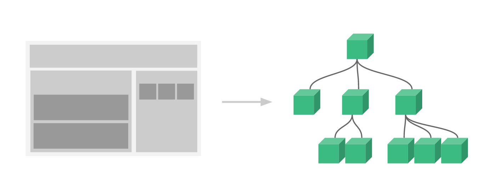
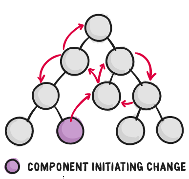
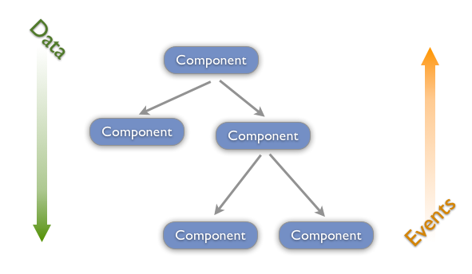
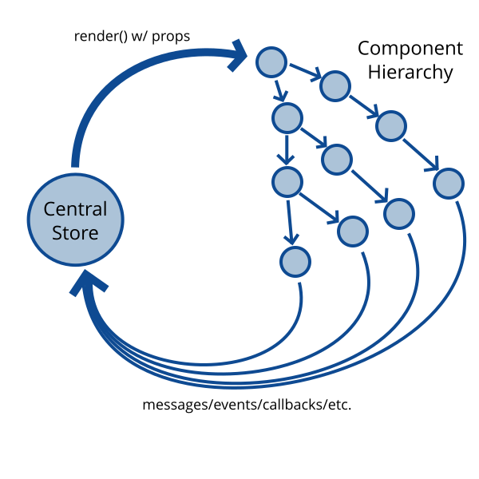
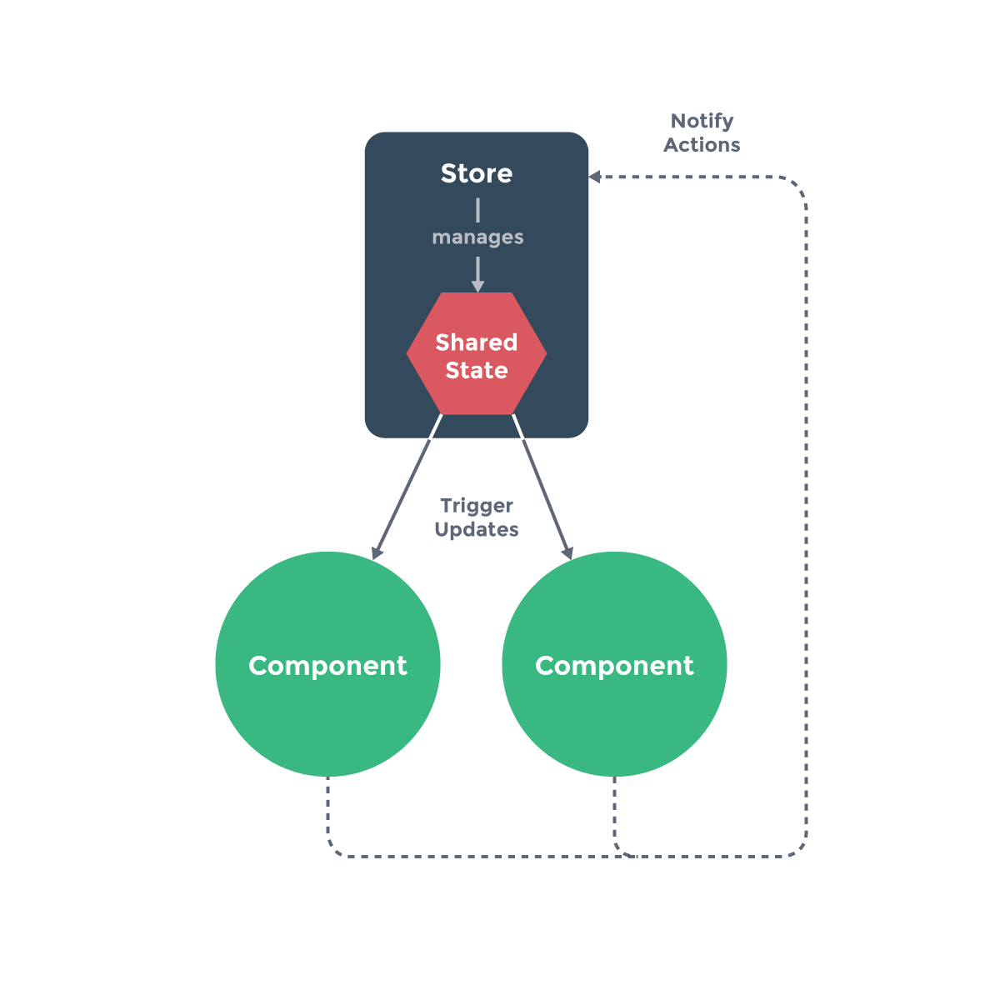
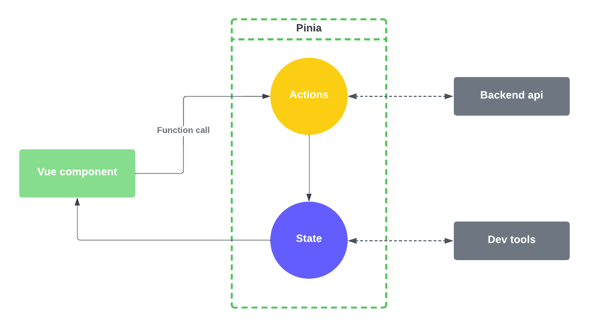
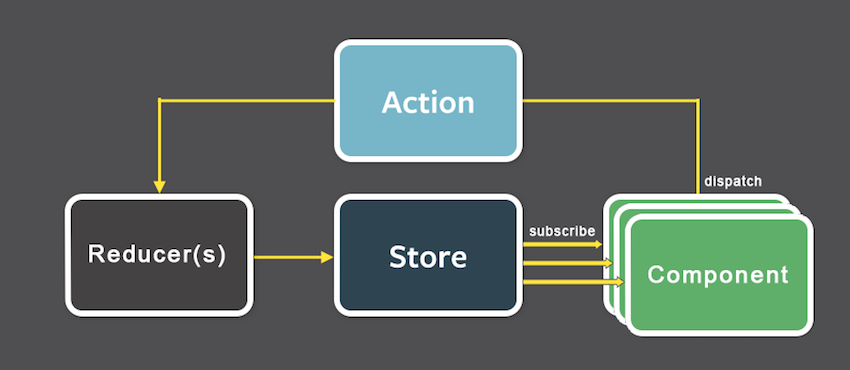

<!-- .slide: class="titulo" -->

# Tema 5: Frameworks JS en el cliente 
## parte III: Gestión del estado


---
<!-- .slide: class="titulo" -->

# 1. Introducción. El estado de una *app*

---

## ¿Qué es el estado de una *app* en *frontend*?

> El conjunto de datos no derivables que gobiernan la representación actual de la interfaz de usuario

- Datos que muestra la *app* y que vienen del servidor
- Datos que ha introducido el usuario y que habrá que sincronizar con el servidor
- Los filtros aplicados localmente a los datos (ej. ver solo items pendientes de la lista de la compra)
- Información global de la app como el usuario autentificado, las preferencias de UI, ...

---

> "Como los requisitos en aplicaciones JavaScript de una sola página se están volviendo cada vez más complicados, nuestro código, mas que nunca, debe manejar el estado. **Este estado puede incluir respuestas del servidor y datos cacheados, así como datos creados localmente que todavía no fueron guardados en el servidor. El estado de las UI también se volvió más complejo**, al necesitar mantener la ruta activa, el tab seleccionado, si mostrar o no un spinner...

> **Controlar ese cambiante estado es difícil**. Si un modelo puede actualizar otro modelo, entonces una vista puede actualizar un modelo, el cual actualiza otro modelo, y esto causa que otra vista se actualice. **En cierto punto, ya no se entiende que esta pasando en la aplicación ya que perdiste control sobre el cuándo, el por qué y el cómo de su estado**. 

De la documentación de Redux: ["Motivación"](http://es.redux.js.org/docs/introduccion/motivacion.html) 

---


<blockquote class="twitter-tweet"><p lang="en" dir="ltr">If you don&#39;t think managing state is tricky, consider the fact that 80% of all problems in all complex systems are fixed by rebooting.</p>&mdash; stuarthalloway (@stuarthalloway) <a href="https://twitter.com/stuarthalloway/status/1134806008528809985?ref_src=twsrc%5Etfw">June 1, 2019</a></blockquote> <script async src="https://platform.twitter.com/widgets.js" charset="utf-8"></script>

---

<!-- .slide: class="titulo" -->

## 2. ¿Cómo organizamos el estado?

---

Recordemos que las aplicaciones Vue, React, Angular... están formadas de **componentes organizados jerárquicamente**



¿Cómo organizamos el estado en los componentes? ¿quién guarda qué datos?

---

## El estado introduce complejidad

- Un componente con estado tiene memoria interna, puede tener efectos laterales, puede sincronizarse mal con otros, es más difícil de testear.
- Un componente sin estado es fácil de entender y testear. Le pasamos *props* y nos devuelve HTML como una **función pura**

```javascript
function Item({ id, nombre, comprado, onToggleItem, onDeleteItem }) {
  
  const estilo = comprado ? "tachado" : "";

  return (
    <>
      <span
        className={estilo}
        onClick={() => onToggleItem(id)}>
          {nombre}
      </span>

      <button onClick={() => onDeleteItem(id)}>
        Eliminar
      </button>
    </>
  );
}
```

Notas: 

Podría ser discutible si el componente anterior tiene efectos laterales, ya que dispara 2 *callbacks*, pero podemos considerar que en cualquier caso los efectos laterales los generaría el que cambiara el estado respondiendo a esos callbacks, no el propio componente, que se limita a decir: "alguien ha hecho click en el item con id 5".

---

## Reducir el número de componentes con estado

La mayoría de componentes serán *presentacionales/tontos* (funciones puras) y solo unos pocos inteligentes/con memoria

Ventajas de los componentes presentacionales:

- Son más reutilizables
- Más testables
- No causan efectos laterales, menos problemas de *debugging*

Vale, pero ¿cómo decidimos qué componentes van a tener estado?

---


Una idea *"lógica"* es que **cada componente almacene localmente su estado**

```javascript
<template>
  <li :class="estado ? 'tachado' : ''" @click="cambiarEstado">
    {{ nombre }}
  </li>
</template>

<script setup>
  import { ref } from 'vue';
  const props = defineProps(["nombre","comprado", "id"])
  const estado = ref(props.comprado);
  const cambiarEstado = () => { estado.value = !estado.value};
</script>

<style scoped>
  .tachado {
    text-decoration: line-through;
  }
</style>
```

- Problema: ¿cómo hacemos una **cuenta de "items que quedan por comprar"**? (en general, cómo hacemos operaciones globales a todos los items como filtrar, ordenar,...)

---

## Levantando el estado

> Principio **Lifting state up** (React): “El estado debe subir al ancestro común más cercano de los componentes que lo necesiten”

 <!-- .element class="stretch"  width="300"-->

Aunque esta "buena práctica" se formuló originalmente [en React](https://www.freecodecamp.org/news/what-is-lifting-state-up-in-react/), luego la han asumido el resto de *frameworks*


---

> Principio **Lifting state up** (React): “El estado debe subir al ancestro común **más cercano** de los componentes que lo necesiten”

Nótese que es el "más cercano". No es "cuanto más alto mejor"
  - Evitar re-rendering de subcomponentes que no cambian
  - Evitar *prop drilling*

 <!-- .element class="stretch"  width="500"-->


---

## Flujo de datos unidireccional

El ancestro con el estado se convierte en la "source of truth" y la información puede fluir unidireccionalmente:

- El ancestro tiene el estado
- Los datos bajan a los descendientes como *props*
- Estos no cambian el estado directamente, emiten *eventos* o llaman a *callbacks*


<div class="column">
  
</div>
<div class="column half">
  
</div>


---

¿Y si, a pesar de todo, **necesitamos** comunicar entre sí componentes no relacionados?

**Event bus**

- Es simplemente un objeto global que permite **publicar eventos y suscribirse a ellos**. Los eventos serán los mensajes entre componentes.
- En Javascript este patrón suele llamarse *event bus* o *event emitter*. Hay multitud de librerías que implementan esta idea

---

## Event Bus en Vue

Tenemos que usar alguna librería externa (aquí usamos [mitt]())

```javascript
//Esto debería ser global a todos los componentes
import mitt from "mitt"
const emitter = mitt()

//para emitir un evento:
emitter.emit("nombre-evento", {dato1:"hola", dato2:1})

//para suscribirse a un evento:
emitter.on("nombre-evento", function(payload) { console.log(payload.dato1)})
```


[Ejemplo completo](https://codesandbox.io/s/event-bus-mitt-vue3-zoyhk)

---

Por desgracia, el *event bus* rompe la idea de *flujo unidireccional*. 

**¿Cómo podemos seguir manteniendo un flujo unidireccional de información en toda la aplicación?**

---

<!-- .slide: class="titulo" -->

## 2. Estado centralizado. El patrón *Store*

---

Idea: ¿por qué no sacamos el estado fuera de todos los componentes y nos lo llevamos a un "almacén centralizado"?

<!-- .element: class="stretch" --> 


De ese modo **todos los componentes** se convertirían en funcionales

---

## El "patrón" *store*

<div class="wrapper texto_figura">
<div>

- _store_: almacén centralizado con el estado de la _app_
- Los componentes **no modifican directamente** el estado, las modificaciones se hacen siempre a través de **métodos del *store*** 

```javascript
var store = {
  state: reactive({
    message: 'Hello!'
  }),
  setMessage (newValue) {
    this.state.message = newValue
  },
  clearMessage () {
    this.state.message = ''
  }
}
```
[Ejemplo completo](https://stackblitz.com/edit/vitejs-vite-xlykub?file=src%2FApp.vue)
</div>

<div>
 
</div>
</div>

---

<!-- .slide: class="titulo" -->

## 3. Estado centralizado en los *frameworks* JS


---

**Pinia** es el *framework* "oficial" de Vue para la gestión centralizada del estado. Es una implementación del "patrón *store*" (algo más sofisticada que lo que vimos antes)

Aunque es particular de Vue se basa en los mismos principios básicos que se aplican habitualmente en otros *frameworks* Javascript: React (Redux,Zustand), Angular (NgRedux), ...


---

## Antecedentes de Pinia

- **[La arquitectura Elm](https://guide.elm-lang.org/architecture/)** (2012): Elm es un lenguaje específico para clientes web que transpila a JS. 
- **[Flux](https://facebookarchive.github.io/flux/)** (2014): arquitectura propuesta por Facebook  para estructurar aplicaciones con su framework React. Más un patrón que un framework.
- **[Redux](https://es.redux.js.org/)** (2015): la implementación de Flux de mayor éxito, normalmente usada en React pero portada luego a frameworks como Angular o Vue.
- **[Vuex](https://vuex.vuejs.org/)**, para Vue, inspirado en *redux* pero sin tanto elemento de programación funcional.

Pinia es una evolución de Vuex con un API simplificado. Muy similar al patrón *store* de antes pero estandarizado, lo que permite enganchar con las devTools, usar *plugins*, etc.

---

## El patrón *store* básico en Pinia

- El *store* es un objeto que contiene las propiedades 
  + `state`: el "árbol global" con el estado de la *app*
  + `getters`: variables calculadas en función del estado
  + `actions`: métodos que implementan la lógica de negocio, normalmente modifican el estado 

```javascript
import { defineStore } from "pinia";

export const useContadorStore = defineStore("contador", {
  state: () => ({ valor: 0 }),  //función que devuelve el estado inicial
  getters: { //reciben el estado como parámetro
    valorDoble: (state) => state.valor * 2
  },
  actions: {  //acceden al estado con this
    incrementar() {
      this.valor++;
    }
  }
});

```

---

## Usar el *store* en un componente

```javascript

<script setup>
  import { useContadorStore } from './store.js';

  const store = useContadorStore();
</script>

<template>
  <div>
    <h1>{{ store.valor }}</h1>
    <button @click="store.incrementar()">Incrementar</button>
  </div>
</template>
```

 [El ejemplo *online*](https://stackblitz.com/edit/vitejs-vite-lfgkns?file=src%2FApp.vue) <!-- .element class="caption" -->


---

## Flujo unidireccional en Pinia




<div class="caption"><a href="https://stackblitz.com/github/ottocol/lista-compra-vue-pinia-local">Ejemplo de la lista de la compra con Pinia y sin backend</a> 
(también usa un <em>plugin</em> para guardar el estado en localStorage)</div>
---

## Pinia vs. Redux

 <!-- .element: class="column half" -->
 <!-- .element: class="column half" -->


---

## Zustand (React)

Simplificación de redux similar a Vuex->Pinia

```javascript
//store.js
import { create } from 'zustand';
export const useCounterStore = create((set) => ({
  count: 0,
  theme: 'light',

  increment: () => set((state) => ({ count: state.count + 1 })),
  toggleTheme: () =>
    set((state) => ({
      theme: state.theme === 'light' ? 'dark' : 'light',
    })),
}));
```

```javascript
//App.jsx 
import { useCounterStore } from './store.js';
export default function App() {
  // puedes extraer solo las partes que necesitas
  const { count, theme, increment, toggleTheme } = useCounterStore();
  //ya podemos usar count y theme como si fueran variables de estado del componente
  // e increment y toggleTheme como callbacks
}
```
[Ejemplo online](https://stackblitz.com/edit/vitejs-vite-oebd3q36) <!-- .element class="caption" -->

---

## Otros frameworks

En Svelte y SolidJS el estado se centraliza en **stores**

- **Svelte**: siguiendo la filosofía minimalista, aunque existen los [stores](https://svelte.dev/docs/svelte/stores), en la mayoría de casos no se recomienda su uso, usar simplemente `$state()` (como `reactive` en Vue, es decir, como un *store* "casero")
- **SolidJS**:  los stores vienen a ser algo intermedio entre el minimalismo de Svelte y Pinia, ver la ["complex state management guide"](https://docs.solidjs.com/guides/complex-state-management) 


---

Para **aplicaciones pequeñas** el estado centralizado no es necesario

> **People often choose Redux before they need it**. “What if our app doesn’t scale without it?” **Later, developers frown at the indirection Redux introduced to their code**. “Why do I have to touch three files to get a simple feature working?” Why indeed!
People blame Redux, React, functional programming, immutability, and many other things for their woes, and I understand them. It is natural to compare Redux to an approach that doesn’t require “boilerplate” code to update the state, and to conclude that Redux is just complicated

<!-- .element: class="caption" --> 
  Dan Abramov, [You Might Not Need Redux](https://medium.com/@dan_abramov/you-might-not-need-redux-be46360cf367)"

---


## Time travel debugging


Si hacemos un *log* de los cambios de estado, avanzando y retrocediendo por él podemos **reproducir el estado de la aplicación en cualquier momento**

[Colada](https://colada.dev), time-travel debugging para Pinia


---

<!-- .slide: class="titulo" -->

## 3. Estado del servidor


---

## Client state vs Server state

Afinando más podemos distinguir entre 

- **client state**, el estado que viene del cliente (p.ej. la lista de la compra en local que hemos visto antes)
- **server state**, el estado que viene del servidor (una lista de la compra con *backend* y colaborativa entre varios usuarios)

---

## El server state es complicado

Viene del servidor (no del usuario local):

- Puede **cambiar en segundo plano** (necesario actualizar datos, mantener *cache*)
- **Tarda tiempo** en cargarse (estado *loading*)
- Puede dar un **error** de carga y puede ser necesario **reintentar la operación**


Pinia no es apropiada para este tipo de estado

---

## Manualmente

- Cada componente hace su fetch
- Estados loading/error duplicados
- No hay cache ni revalidación
- Peticiones repetidas si hay varios componentes

```javascript
async mounted() {
  this.loading = true
  try {
    const res = await getPosts()
  } catch (e) {
    this.error = e
  } finally {
    this.loading = false
  }
}
```

---

## Tanstack Query

[https://tanstack.com](https://tanstack.com)

```javascript
const { data, isLoading, isError, error } =
  useQuery({
    queryKey: ['posts'],
    queryFn: getPostsPage,
    staleTime: 10000,   //en ms
  })
````

✅ Loading/error reactivos <br>
✅ Cache compartida por queryKey<br>
✅ No duplica peticiones<br>
✅ Refetch automático <br>


[Demo online](https://stackblitz.com/github/ottocol/client-blog-tanstack)

---

## Actualizaciones optimistas

Antes de esperar la respuesta del servidor (OK, error) se actualiza la cache local para que la interfaz parezca instantánea. Si luego el servidor devuelve error (`onError`) deshacemos los cambios. Si todo ha ido bien (`onSettled`) en el ejemplo invalidamos la cache por si alguien le ha dado like a otro post.

Ver el código de `useLikeMutation` en [usePostsQueries.js](https://github.com/ottocol/client-blog-tanstack/blob/main/src/queries/usePostsQueries.js)


---


## Pinia Colada

[https://pinia-colada.esm.dev](https://pinia-colada.esm.dev)

(aunque se llama igual que el *plugin* para *time-travel debugging* esta es una librería de gestión del *server state*)