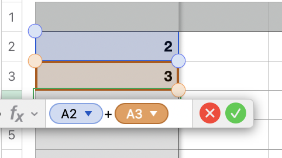
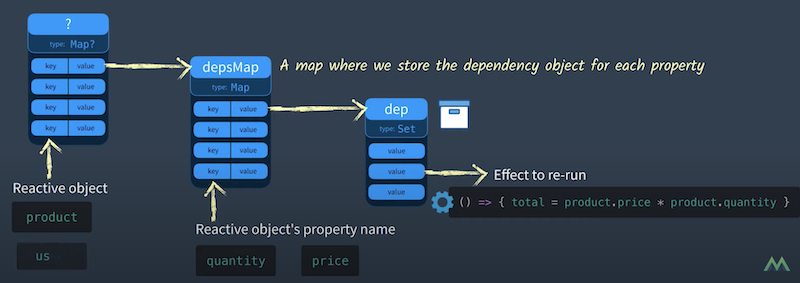
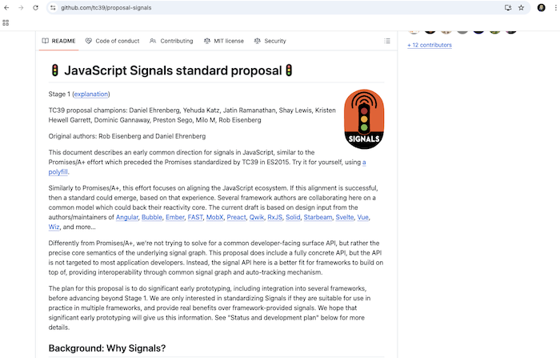
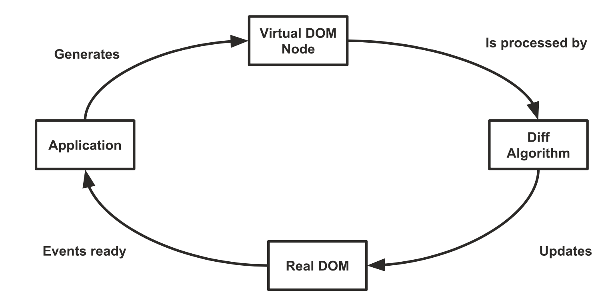
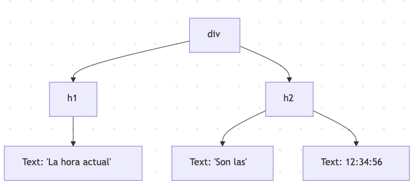

<!-- .slide: class="titulo" -->

# Tema 5: *Frameworks* JS en el cliente
## Parte II: Reactividad y _rendering_ en Frameworks JS

---

Recordemos que prácticamente todos los *frameworks JS* actuales tienen características similares:

- Basados en la idea de **componentes** *anidables*
- Automatizan el *rendering*  de HTML (gracias a la **reactividad**)
- Implementan **routing** (*)
- Ofrecen mecanismos de **gestión del estado** (los datos que no son propios de los componentes) (*)

(*) Algunos *frameworks* tienen esto integrado, en otros son *plugins*


---

<!-- .slide: class="titulo" -->

# Reactividad en *frameworks* JS


---

Aunque **reactividad** es un término bastante amplio que tiene distintos significados en distintos contextos, en el contexto de los *frameworks* JS se suele entender como:

1. **cambiar automáticamente el valor de una variable** cuando esta depende de otra
2. **repintar la vista automáticamente cuando cambia el estado** del componente 

En general todos los *frameworks* JS son reactivos al menos en el sentido (2), en el (1) solo algunos como Vue, Svelte, SolidJS, ...

---

En realidad la reactividad no es nada nuevo

 <!-- .element class="stretch" -->


---


Como ya sabíais, Javascript no es reactivo:

```javascript
var cantidad = 2
var precio = 10
var total = cantidad * precio
console.log(total)  //20
cantidad = 5
console.log(total)  //no es 50, sigue siendo 20 😕
```

Pero ¿lo son en este sentido los frameworks Javascript?

---

## Reactividad en Vue


```javascript
import { reactive, effect } from 'vue'

const estado = reactive({
  cantidad: 2,
  precio: 10,
})

let total = 0

effect(() => {
  // Lee cantidad, precio -> queda suscrito a ambas
  total = estado.cantidad * estado.precio
  console.log('total =', total)
})

estado.cantidad = 5   // -> recalcula: total = 50
estado.precio = 15  // -> recalcula: total = 75
```

[El ejemplo online](https://play.vuejs.org/#eNqdU1tv0zAU/itHfmk3hWTrqJCiteKiPYAQIODRLyY5LR6OHeKT0qnqf+fYbkO4ddPefC7f5+/cduJF2+abHkUprn3V6ZbAI/XtUlrdtK4j2EGHqiK9wQxwtcKKYA+rzjUwYdxEWmkrZz0BelK1g8WQP91JC1ApS7pWdQmzLNhth5V2JVxesLk/C3iDBORIGQZfBEf6Zzo9g8USIktRwFvEgSw70MCTJXzvsVbg+yCfHChQzRflA+jImZTlRzCcHz2JJKrkEpzB3Lj1dHLATbLEwBqTzj95FjCHKI1VMJMyVW9UOXw751p++4h9l4z4L+DZXNrrIo2BB8AGYdMaRZisYjBFJsiz5pVe57feWR5fbJMUlWtabbB735LmmqQoUwNDTBnjfryJPup6jOOImK9YffuH/9Zvg0+KDx167DYoxRAj1a2RUvjm0zvc8nsINq7uDWefCH5E7ncfNKa0l72tWfYoL6p9HZdQ2/Vnf7MltP5YVBAaMvcxXwrexVcnSv8l9yp/GnE8VO5iwDx6/58zsDhENd2NboGnTvj3KbjeUglh8cMd6AofewaBCO4Sx8NuICrKE/D8YEX4g7d/zLCA2anNn7H80Rf37f1VrPbE7vMEx9svrdj/BAV+k3c=) <!-- .element class="caption" -->


Notas: 
Para comprobar la reactividad más claramente, añadir una línea
`setInterval(()=>estado.cantidad++, 1000)`

---

## Cómo funciona "por dentro"

Para cada propiedad de cada objeto reactivo guardamos la lista de los *effects* que leen su valor

 <!-- .element class="stretch" -->

[Del video "Reactivity in Vue 3: How does it work?"](https://www.youtube.com/watch?v=NZfNS4sJ8CI) <!-- .element class="caption" -->


---

- Cada vez que modificamos una propiedad de un objeto reactivo, debemos ejecutar automáticamente todos los *effects* asociados 
- Vue usa *proxies* ES6, una funcionalidad estándar de JS para "envolver" objetos interceptando las llamadas a sus métodos
- El `reactive` de Vue devuelve un *proxy*

```javascript
let estado = {valor:1}
//el handler del proxy, en el ejemplo interceptamos los setters
let handler = {
  set: function(obj, prop, val) {
    //en Vue estaría ejecutando los effects asociados a "prop"
    console.log('cambiando', prop, "a", val)
    //Aplico el cambio manualmente
    obj[prop] = val
  }
}
let estadoProxy = new Proxy(estado, handler)
estadoProxy.valor = 2
```
[El ejemplo online](https://playcode.io/2045583) <!-- .element class="caption" -->


---

**Vue define effects automáticamente en las templates**, asociados a las variables usadas, para que al volver a ejecutar el *effect* se actualice automáticamente el HTML

[https://vuejs.org/guide/extras/rendering-mechanism.html#render-pipeline](https://vuejs.org/guide/extras/rendering-mechanism.html#render-pipeline)


---

## Reactividad en SolidJS: signals

El *framework* SolidJS usa **signals** y **effects** para modelar la reactividad, son ideas similares a las de Vue

```javascript
import { createSignal, createEffect } from "solid-js";

const [valor, setValor] = createSignal(1);
createEffect(() => console.log("valor", valor()));
  
setValor(valor()+1)
```

[El ejemplo online](https://playground.solidjs.com/anonymous/fec3a75f-4fac-4ae8-8b80-849dafc7e94f) <!-- .element class="caption" -->

Nótese que `valor()` es una función para poder interceptar la operación de "leer valor", SolidJS no usa *proxies* para esto (aunque sí para otras cosas).

Notas: 
Para comprobar la reactividad más claramente, añadir una línea
`setInterval(()=>setValor(valor()+1), 1000)`

---

Por supuesto SolidJS usa la reactividad al hacer *rendering* de los componentes

```javascript
import { createSignal } from "solid-js";
import {render} from "solid-js/web"

function Contador() {
  // Creamos una signal para el contador
  const [count, setCount] = createSignal(1);

  return (
    <div>
      <h1>Contador reactivo con SolidJS</h1>
      <h1>Contador: {count()}</h1>
      <button onClick={() => setCount(count() + 1)}>Incrementar</button>
    </div>
  );
}

render(()=><Contador/>, document.getElementById("app"))
```

[El ejemplo online](https://playground.solidjs.com/anonymous/87241469-f8b9-4d2e-afa1-63643f46eefb) <!-- .element class="caption" -->

---

## Signals, signals everywhere

En los últimos tiempos, **las *signals* se han "puesto de moda" como primitiva para modelar la reactividad** y se han incorporado a algunos *frameworks* ya existentes como Angular, Preact o Svelte (aunque en este último se llaman [*runes*](https://svelte.dev/blog/runes))

```javascript
<script>
    let count = $state(0);
    let doubled = $derived(count * 2);
</script>
<h1>Contador: {count}</h1>
<h1>Doble: {doubled}</h1>
<button onclick={()=>count++}>Incrementar</button>
````

[Ejemplo online](https://svelte.dev/playground/d594d05ff4f448d7b56ebb403dfbe5d1?version=5.1.3) <!-- .element class="caption" -->

---

- Hay una [propuesta](https://github.com/tc39/proposal-signals) en curso para estandarizar las *signals* en Javascript

  <!-- .element class="stretch" -->

---

## Svelte 4: reactividad en tiempo de compilación 

- Hasta la versión 4 seguía un enfoque distinto a Vue, en lugar de hacer "la magia" en *runtime*, es un **compilador** que genera "código reactivo".  
- Esto en teoría genera un código más *ligero* y eficiente.
- [Ejemplo online](https://svelte.dev/playground/a17ccc68af7d44948dee4b68256766dc?version=4.1.0) (en la versión 5 cambia el código que genera el compilador)


Notas: 

- En Svelte la template es todo lo que está fuera de `<script></script>`
- Mirar la solapa "JS Output" para ver el resultado del compilador de Svelte
- La función `c()` es la que  crea el HTML de la template, `m()` la monta en el DOM
- `p(ctx,dirty)` actualiza solo las partes que pueden cambiar (simplificando, `ctx` son las variables y `dirty` las que han cambiado)


---
<!-- .slide: class="titulo" -->

# Reactividad y *Rendering*

---

Cómo implementa cada framework la reactividad influye en cómo implementa también la actualización automática de la UI (el HTML del documento) cuando cambian los datos

- En un extremo, React es "el menos reactivo" de todos los frameworks así que tiene que acudir a **mecanismos externos** (el Virtual DOM) para que la actualización del HTML sea eficiente
- En el otro extremo, SolidJS usa una **reactividad "de grano fino"** por lo que es muy eficiente actualizando el HTML

---

## Componentes en React

- Los componentes son **funciones**
- La vista se define con **JSX** (una mezcla de JS y HTML)

```javascript
import React, from 'react';

function App() {
  const items = ['Pan', 'Leche', 'Huevos', 'Frutas', 'Verduras'];
  let lista
  if (items.length>0) {
    lista = <div> <h2>Lista de la compra</h2>
      <ul>
        {items.map((item) => (
          <li>{item}</li>
        ))}
      </ul> </div>
  }
  else {
    lista = <p> Tu lista está vacía </p>
  }
  return lista
}
```

[El ejemplo online](https://reactplayground.vercel.app/#N4IgLgziBcBmCGAbCBTANCAbrK1QEsA7AExQA8A6AK1xHwFsAHAewCcwACAQUcY9lbN6HAOQUA9D0bUIZEQB1CDFuw4AlFPADGnAUNGtNOhUqZtOwDlsPwwKNc2acAvv0HCRNnQFpiQ8VqI+CiEYCaKWsyEEJyRofBEKKwcALwcfloArvQhYBQA5ihgAKKIKDmhAEIAngCSxAAUno5hAJQRUTEcgk6pVjZ2Dk4NcWAJhEnthD15hiRJDYoc6kZ51pp2peW5i4TLyxraeQDKYKz4OgCyzKRoS-uEmYiId3v7hzoU67YoWxVgDSkU2WU1aIAwUhkZBgdDMqg+YDQHEsmVQpx+HFcemE8hAXjAuIA3IpFLBMoQdPgotxeA1Wsj7nEuvg7PQIH0ANr3Za4gAK8EIuNe+w4uIAMigtAALFBC7mikAACUyKEwzAgcrePJAADFWJkxhrwfLcQA1JLETKseBG4UcAC6xLeZU4QRi8Hu+FgHAaLPKEAoZUI+TAUoAfAAGenAeVusZ9AA8xHwmDD8uWCalACYw2L8O70igOIh4FYhIxrQnxNm01r9gmnrWRSLgH62RR6PBGA1faz6Skwz7082E0Ew63Wc4q2PhyDWs5h1XG-Kq8nU-cF28UMgizG63HS2kE4xBwAVTLF-PxlAxACHHEw2gAt6WqyeN-dDGArXsD4pN4o5AqJwpAIE8nBSE6IDOM4QA) <!-- .element class="caption" -->


---

## Más sobre JSX

- El código JSX se compila a código Javascript "puro" que crea las etiquetas especificadas en el JSX 
- La compilación la hace un transpilador, típicamente Babel ([El ejemplo de antes](https://babeljs.io/repl#?config_lz=N4IgZglgNgpgdgQwLYxALhAJxgBygOgCsBnADxABoQdtiYAXY9AbWZHgDdLR6FMBzBkwwATGGAQBXKIwoACOAHt6ciDDkBGDfKUq1AfSSKARpo2UQRkdJjCJUOlWOT-kUrfT1MkmAF8AuhRs2AgAxvTcWJJw9BAo6CBS9IpICLGhIAFBIMS8ggC0AEyRYqGKmGnlxABqMJjEEIpwCYUADIUAzPlaFjgQODBQEHAwAAqYijiKxAhQCQAWYQDWmf6BOYqSmKEwACoAngMJVjaZQA&code_lz=JYWwDg9gTgLgBAJQKYEMDGMA0cDecCuAzkgMowoxJwC-cAZlBCHAERSoYsDcAUD3fgB2GYBEFwAgmDAAKAJS4ecOGjGF4wSiEJwAvHADaS5awAKKQS0zHlLADJI0ACyRWbrABL4kANwiE3E1YAMSh8cgDrIJYANSQoABN8KBRI4wBdXmUAGyR4bOB1FGNgOjgZTSRtADpcwQBzGCcAPgAGBRx3AqK9OAAeBOAfZvdlPqcAJma7QvI4BKpslBUmMBS-gHpJkaCx_Gyd3eUcSpqQFFkKrQVdZvLR3b6C5pOtak3nh-U5OWoHzf2hzGG0Gw2Mf2USGyxEUQW6c30fTAdwAKvg4PDlkh1ABDuA-dAAW-Wm2R4OM7BgyXEmJ4fx4SAAHpBYPMkHQUPt4FIwFwgA&lineWrap=true&prettier=true&version=7.25.8))

---

## React es reactividad "de grano grueso"

En el ejemplo tenemos un componente `App` con dos subcomponentes `Counter` y `Message`. Cuando se actualizan los datos se renderiza todo de nuevo

[Ejemplo online](https://reactplayground.vercel.app/#N4IgLgziBcBmCGAbCBTANCAbrK1QEsA7AExQA8A6AK1xHwFsAHAewCcwACAQUcY9lbN6HAOQUA9D0bUIZEQB1CDFuw4AlFPADGnAUNGtNOhUqZtOwDlsPwwKNc2acAvv0HCRNnQFpiQ8VqI+CiEYCaKWsyEEJyRofBEKKwcALwcfloArvQhYBQA5ihgAKKIKDmhAEIAngCSxAAUno5hAJQRUTEcgk6pVjZ2Dk4NcWAJhEnthD15hiRJDYoc6kZ51pp2peW5i4TLyxraeQDKYKz4OgCyzKRoS-uEmYiId3v7hzoU67YoWxVgDSkU2WU1aIAwUhkZBgdDMqg+YDQHGAmVQpx+rj0Hi8YUU934mUIOnwUW4vAarWR+P2cS6AG1IoTERxUGAAMLMJkAXT6qJQ6LsDQADK0ANzU5a0zh0nIQCDwQpI1mXFByhUoHlpPkClBNBH4TD4YjwYgAQlNIjFeLe+ysnWYZQoiGY+SaUhZKA4AAt4N0QqRzgAvE3MS3iwgSglEsAkvZEdb-ClUm225asjlMkac0IcADUHAAjMDU85ramo8TSZlGMa7Cq1YUk8BI8sypxHihMMw+ox3IwASIAHKZTvdiryqgoMMtjj4WAcBodruU5sp8sesD1+WNpfMK1r-alg9HyOGMCZVh7XbrjgAHmIBoAfDPlsBxAAqDgcswTUKexjwKwvooIgdrxH4yTvuIR43sst4Zn+ySMqEKTAMhYCuFEtREoY-yofGuG5K44jPhGB62m+n7fiwv52BwAFARwIEcOO8CThwUEwbBt5buqL77LK24oKhgnqlxsEcFEACqNY-LxhSodWtYoPJKDieuJEzre4gPpgpHlvutonimsCEpWewIXYrANJY6FIlhOHbDmzgrpGtIOigTouk0llJB63q+nMAb4MGfjTmR5ZnheV5abp+ncV6BaPmh2YYdpiXxTet4AEaZGAYCklEbJBFoADWqEOQmRGPthVXxKw2m5flUSZam2lxZGhmHmW+ymdGsYcKpNksaqQn2YQMnKapHAucm5buY6zquiI02oAFfrzEGIbhaeRTRQusVPvxt6MMlomFM42mncdTUFXsRUleVwDSbJdajWJj5cDomRICFgEjdEbEoI1eV3a1trtUdB5dcsxm2uQKicKQCBPJwUggM4zhAA)


Notas:

El código del ejemplo

```javascript
import React, {useState} from 'react'

   function App() {
      const [count, setCount] = useState(0);
      const [message, setMessage] = useState('Reactividad!!');

      console.log('App se ha renderizado');

      function increment() {
         setCount(count + 1)
      }

      function updateMessage() {
        let nuevo = prompt('Nuevo mensaje');
        if (nuevo) {
           setMessage(nuevo);
        }
      }

      return (
        <div>
          {/* Componente para el contador */}
          <Counter count={count} onIncrement={increment} />

          {/* Componente para el mensaje */}
          <Message
            message={message}
            onUpdateMessage={updateMessage}
          />
        </div>
      );
    }

    function Counter({ count, onIncrement }) {
      console.log('Counter se ha renderizado');

      return (
        <div>
          <h1>{count}</h1>
          <button onClick={onIncrement}>Incrementar</button>
        </div>
      );
    }

    function Message({ message, onUpdateMessage }) {
      console.log('Message se ha renderizado');

      return (
        <div>
          <p>{message}</p>
          <button onClick={onUpdateMessage}>Actualizar mensaje</button>
        </div>
      );
    }

    export default App
```

---


## El problema del renderizado en React

- Re-renderiza todo el árbol de componentes desde donde cambia el estado hacia abajo aunque el estado de algún subcomponente no cambie
- Si os fijáis, el JSX de un componente se ejecuta entero cada vez  (*como los gráficos de un juego que se repintan enteros n veces por segundo*) ([ejemplo del reloj](https://codepen.io/ottocol/pen/QWWVWPa?editors=1010))

**¿Cómo reducir entonces el coste del renderizado?**


---

## DOM virtual

- Una de las aportaciones de React
- El JSX no genera nodos del DOM real, sino en memoria (en un "árbol DOM virtual"), con un API más rápido
- En cada *render* se hace una especie de *diff* entre el DOM virtual actual y el anterior (["reconciliation"](https://reactjs.org/docs/reconciliation.html)). En React **el coste es lineal con el número de nodos**



**Solo se repintan en el DOM real los nodos que cambian**. 


Notas:

- El coste teórico de encontrar el mínimo número de nodos a cambiar para actualizar el DOM es O(n^3), pero React usa una serie de heurísticas que le permiten reducir el coste a O(n)

---


[Ejemplo del reloj](https://codepen.io/ottocol/pen/QWWVWPa?editors=1010). Aunque en el código de la función de *render* se repinta el componente entero, en el navegador solo se está cambiando un nodo.

 <!-- .element class="stretch" -->


---

Según se mire, podéis considerar el DOM virtual como una idea genial o todo lo contrario...

[Virtual DOM is pure overhead, Rich Harris](https://svelte.dev/blog/virtual-dom-is-pure-overhead)


Posiblemente la mejor parte del DOM virtual es que le permite al desarrollador de React mantener un **modelo mental sencillo** de "cómo se pinta todo el sistema en el estado actual" 

---

## Reactividad de grano fino: Ejemplo con SolidJS

SolidJS compila el JS para generar código que solo actualiza la parte del DOM que cambia.

[El ejemplo del contador que vimos antes](https://playground.solidjs.com/anonymous/87241469-f8b9-4d2e-afa1-63643f46eefb)


Notas:

La estructura base del DOM se crea a partir de la template:

```javascript
var _tmpl$ = _$template(`<div><h1>Contador reactivo con SolidJS</h1><h1>Contador: </h1><button>Incrementar`);
```
La parte crucial donde se actualiza el DOM está en esta línea:

```javascript
javascriptCopy_$insert(_el$3, count, null);
```
- `_el$3`es el h1 donde está el contador (el nextSibling del FirstChild)
Esta es la línea "mágica" donde Solid establece la actualización reactiva. `_$insert` es una función que:
- Inserta el valor inicial del contador en el DOM
- Crea una suscripción para actualizar automáticamente ese nodo del DOM cuando la signal `count` cambie

Cuando se hace click en el botón, setCount modifica el valor de la signal, lo que automáticamente desencadena la actualización del DOM gracias a la suscripción creada por `_$insert`.

---


## Signals en Preact


```javascript
const count = signal(0);

function Unoptimized() {
  // Re-renders the component when `count` changes:
  return <p>{count.value}</p>;
}

function Optimized() {
  // Text automatically updates without re-rendering the component:
  return <p>{count}</p>;
}
``` 


> "Con signals podemos **evitar el renderizado del DOM Virtual y vincular los cambios de la signal directamente a mutaciones del DOM**. Si pasas una signal a JSX en una posición de texto, se renderizará como texto y se actualizará automáticamente en su lugar sin necesidad de hacer diffing del DOM Virtual." <br><br>
De la [documentación de Preact](https://preactjs.com/guide/v10/signals/#rendering-optimizations) 


[ejemplo online más complejo: *hooks* vs *signals*](https://preactjs.com/repl?code=aW1wb3J0IHsgaCB9IGZyb20gJ3ByZWFjdCc7CmltcG9ydCB7IHVzZVN0YXRlIH0gZnJvbSAncHJlYWN0L2hvb2tzJzsKaW1wb3J0IHsgc2lnbmFsLCBlZmZlY3QgfSBmcm9tICJAcHJlYWN0L3NpZ25hbHMiOwoKLy8gRXN0aWxvcyBiw6FzaWNvcwpjb25zdCBzdHlsZXMgPSBgCiAgLmNvbnRhaW5lciB7CiAgICBwYWRkaW5nOiAxcmVtOwogICAgYm9yZGVyOiAxcHggc29saWQgI2NjYzsKICAgIGJvcmRlci1yYWRpdXM6IDRweDsKICB9CiAgCiAgLnRpdGxlIHsKICAgIGZvbnQtc2l6ZTogMS4yNXJlbTsKICAgIG1hcmdpbi1ib3R0b206IDFyZW07CiAgfQogIAogIC5idXR0b24gewogICAgcGFkZGluZzogMC41cmVtIDFyZW07CiAgICBiYWNrZ3JvdW5kLWNvbG9yOiAjM2I4MmY2OwogICAgY29sb3I6IHdoaXRlOwogICAgYm9yZGVyOiBub25lOwogICAgYm9yZGVyLXJhZGl1czogNHB4OwogICAgbWFyZ2luLXRvcDogMC41cmVtOwogICAgY3Vyc29yOiBwb2ludGVyOwogIH0KICAKICAuYnV0dG9uOmhvdmVyIHsKICAgIGJhY2tncm91bmQtY29sb3I6ICMyNTYzZWI7CiAgfQogIAogIC5leHBlbnNpdmUtY29tcG9uZW50IHsKICAgIHBhZGRpbmc6IDFyZW07CiAgICBib3JkZXI6IDFweCBzb2xpZCAjY2NjOwogICAgYm9yZGVyLXJhZGl1czogNHB4OwogICAgbWFyZ2luLXRvcDogMC41cmVtOwogICAgYmFja2dyb3VuZC1jb2xvcjogI2YzZjRmNjsKICB9CiAgCiAgLmZsZXgtY29udGFpbmVyIHsKICAgIGRpc3BsYXk6IGZsZXg7CiAgICBnYXA6IDFyZW07CiAgICBwYWRkaW5nOiAxcmVtOwogIH0KYDsKCi8vIFZlcnNpw7NuIGNvbiBIb29rcyBkZSBQcmVhY3QKY29uc3QgQ291bnREaXNwbGF5SG9va3MgPSAoeyBjb3VudCB9KSA9PiB7CiAgZWZmZWN0KCgpID0%2BIHsKICAgIGNvbnNvbGUubG9nKCLwn5OKIFZhbG9yIGRlIGNvdW50IGVuIEhvb2tzIGFjdHVhbGl6YWRvIGE6IiwgY291bnQpOwogIH0pOwoKICBjb25zb2xlLmxvZygi8J%2BUhCBSZW5kZXJpemFuZG8gQ291bnREaXNwbGF5IGVuIEhvb2tzIik7CiAgcmV0dXJuIDxkaXY%2BQ29udGFkb3I6IHtjb3VudH08L2Rpdj47Cn07CgpmdW5jdGlvbiBDb250YWRvckhvb2tzKCkgewogIGNvbnNvbGUubG9nKCLwn5SEIFJlbmRlcml6YW5kbyBjb21wb25lbnRlIHByaW5jaXBhbCBIb29rcyIpOwogIGNvbnN0IFtjb3VudCwgc2V0Q291bnRdID0gdXNlU3RhdGUoMCk7CiAgCiAgcmV0dXJuICgKICAgIDxkaXYgY2xhc3NOYW1lPSJjb250YWluZXIiPgogICAgICA8aDIgY2xhc3NOYW1lPSJ0aXRsZSI%2BRGVtbyBjb24gSG9va3M8L2gyPgogICAgICA8Q291bnREaXNwbGF5SG9va3MgY291bnQ9e2NvdW50fSAvPgogICAgICA8YnV0dG9uIAogICAgICAgIGNsYXNzTmFtZT0iYnV0dG9uIgogICAgICAgIG9uQ2xpY2s9eygpID0%2BIHNldENvdW50KGMgPT4gYyArIDEpfQogICAgICA%2BCiAgICAgICAgSW5jcmVtZW50YXIKICAgICAgPC9idXR0b24%2BCiAgICAgIDxkaXY%2Bw5psdGltbyByZW5kZXI6IHtuZXcgRGF0ZSgpLnRvTG9jYWxlVGltZVN0cmluZygpfTwvZGl2PgogICAgPC9kaXY%2BCiAgKTsKfQoKLy8gVmVyc2nDs24gY29uIFNpZ25hbHMKY29uc3QgQ291bnREaXNwbGF5U2lnbmFscyA9ICh7IGNvdW50IH0pID0%2BIHsKICBlZmZlY3QoKCkgPT4gewogICAgY29uc29sZS5sb2coIvCfk4ogVmFsb3IgZGUgY291bnQgZW4gU2lnbmFscyBhY3R1YWxpemFkbyBhOiIsIGNvdW50LnZhbHVlKTsKICB9KTsKCiAgY29uc29sZS5sb2coIvCflIQgUmVuZGVyaXphbmRvIENvdW50RGlzcGxheSBlbiBTaWduYWxzIik7CiAgcmV0dXJuICgKICAgIDxkaXY%2BCiAgICAgIDxkaXY%2BQ29udGFkb3IgZGlyZWN0bzoge2NvdW50fTwvZGl2PgogICAgICA8ZGl2PkNvbnRhZG9yIGNvbiAudmFsdWU6IHtjb3VudC52YWx1ZX08L2Rpdj4KICAgICAgPGRpdj5Db250YWRvciAqIDI6IHtjb3VudC52YWx1ZSAqIDJ9PC9kaXY%2BCiAgICA8L2Rpdj4KICApOwp9OwoKZnVuY3Rpb24gQ29udGFkb3JTaWduYWxzKCkgewogIGNvbnNvbGUubG9nKCLwn5SEIFJlbmRlcml6YW5kbyBjb21wb25lbnRlIHByaW5jaXBhbCBTaWduYWxzIik7CiAgY29uc3QgY291bnQgPSBzaWduYWwoMCk7CiAgCiAgcmV0dXJuICgKICAgIDxkaXYgY2xhc3NOYW1lPSJjb250YWluZXIiPgogICAgICA8aDIgY2xhc3NOYW1lPSJ0aXRsZSI%2BRGVtbyBjb24gU2lnbmFsczwvaDI%2BCiAgICAgIDxDb3VudERpc3BsYXlTaWduYWxzIGNvdW50PXtjb3VudH0gLz4KICAgICAgPGJ1dHRvbiAKICAgICAgICBjbGFzc05hbWU9ImJ1dHRvbiIKICAgICAgICBvbkNsaWNrPXsoKSA9PiBjb3VudC52YWx1ZSsrfQogICAgICA%2BCiAgICAgICAgSW5jcmVtZW50YXIKICAgICAgPC9idXR0b24%2BCiAgICAgIDxkaXY%2Bw5psdGltbyByZW5kZXI6IHtuZXcgRGF0ZSgpLnRvTG9jYWxlVGltZVN0cmluZygpfTwvZGl2PgogICAgPC9kaXY%2BCiAgKTsKfQoKLy8gQ29tcG9uZW50ZSBwcmluY2lwYWwKZXhwb3J0IGRlZmF1bHQgZnVuY3Rpb24gQ29tcGFyaXNvbigpIHsKICByZXR1cm4gKAogICAgPD4KICAgICAgPHN0eWxlPntzdHlsZXN9PC9zdHlsZT4KICAgICAgPGRpdiBjbGFzc05hbWU9ImZsZXgtY29udGFpbmVyIj4KICAgICAgICA8Q29udGFkb3JIb29rcyAvPgogICAgICAgIDxDb250YWRvclNpZ25hbHMgLz4KICAgICAgPC9kaXY%2BCiAgICA8Lz4KICApOwp9CgpyZW5kZXIoPENvbXBhcmlzb24gLz4sIGRvY3VtZW50LmdldEVsZW1lbnRCeUlkKCJhcHAiKSk%3D)

Notas:

El código del ejemplo:

```javascript
import { h } from 'preact';
import { useState } from 'preact/hooks';
import { signal, effect } from "@preact/signals";

// Estilos básicos
const styles = `
  .container {
    padding: 1rem;
    border: 1px solid #ccc;
    border-radius: 4px;
  }
  
  .title {
    font-size: 1.25rem;
    margin-bottom: 1rem;
  }
  
  .button {
    padding: 0.5rem 1rem;
    background-color: #3b82f6;
    color: white;
    border: none;
    border-radius: 4px;
    margin-top: 0.5rem;
    cursor: pointer;
  }
  
  .button:hover {
    background-color: #2563eb;
  }
  
  .expensive-component {
    padding: 1rem;
    border: 1px solid #ccc;
    border-radius: 4px;
    margin-top: 0.5rem;
    background-color: #f3f4f6;
  }
  
  .flex-container {
    display: flex;
    gap: 1rem;
    padding: 1rem;
  }
`;

// Versión con Hooks de Preact
const CountDisplayHooks = ({ count }) => {
  effect(() => {
    console.log("📊 Valor de count en Hooks actualizado a:", count);
  });

  console.log("🔄 Renderizando CountDisplay en Hooks");
  return <div>Contador: {count}</div>;
};

function ContadorHooks() {
  console.log("🔄 Renderizando componente principal Hooks");
  const [count, setCount] = useState(0);
  
  return (
    <div className="container">
      <h2 className="title">Demo con Hooks</h2>
      <CountDisplayHooks count={count} />
      <button 
        className="button"
        onClick={() => setCount(c => c + 1)}
      >
        Incrementar
      </button>
      <div>Último render: {new Date().toLocaleTimeString()}</div>
    </div>
  );
}

// Versión con Signals
const CountDisplaySignals = ({ count }) => {
  effect(() => {
    console.log("📊 Valor de count en Signals actualizado a:", count.value);
  });

  console.log("🔄 Renderizando CountDisplay en Signals");
  return (
    <div>
      <div>Contador directo: {count}</div>
      <div>Contador con .value: {count.value}</div>
      <div>Contador * 2: {count.value * 2}</div>
    </div>
  );
};

function ContadorSignals() {
  console.log("🔄 Renderizando componente principal Signals");
  const count = signal(0);
  
  return (
    <div className="container">
      <h2 className="title">Demo con Signals</h2>
      <CountDisplaySignals count={count} />
      <button 
        className="button"
        onClick={() => count.value++}
      >
        Incrementar
      </button>
      <div>Último render: {new Date().toLocaleTimeString()}</div>
    </div>
  );
}

// Componente principal
export default function Comparison() {
  return (
    <>
      <style>{styles}</style>
      <div className="flex-container">
        <ContadorHooks />
        <ContadorSignals />
      </div>
    </>
  );
}

render(<Comparison />, document.getElementById("app"))
```

---


| Framework            | Tipo de reactividad                    | Cuándo se resuelve | Características                                      |
| -------------------- | -------------------------------------- | ------------------ | ---------------------------------------------------- |
| **Svelte 3/4**       | *Compilador estático*                  | En compilación     | No hay runtime; super eficiente pero menos flexible  |
| **Svelte 5 (Runes)** | *Sistema de señales (fine-grained)*    | En ejecución       | Igual que SolidJS: efectos y derivaciones explícitos |
| **Vue 3**            | *Reactividad proxy + efecto de render* | En ejecución       | Reactividad a nivel de componente                    |
| **SolidJS**          | *Fine-grained por señales*             | En ejecución       | Igual que Svelte 5, sin VDOM                         |
| **React**            | *Re-render de componentes*             | En ejecución       | No tiene reactividad propiamente dicha               |

---

## Referencias


- 📺 [Evan You on Vue.js: Seeking the Balance in Framework Design | JSConf.Asia 2019](https://www.youtube.com/watch?v=ANtSWq-zI0s)
- 📺 Reactivity in Vue 3: How does it work? [video1](https://www.youtube.com/watch?v=NZfNS4sJ8CI) [video2](https://www.vuemastery.com/courses/vue-3-reactivity/proxy-and-reflect/) (para ver el vídeo 2 tenéis que registraros en el sitio web del curso de Vue)
- [Cómo funciona el compilador de Svelte](https://lihautan.com/compile-svelte-in-your-head-part-1/) (Svelte 4)
- 📺 [A comparison of the Reactivity Concepts in Angular, React, Vue and Svelte by Jonas Bandi](https://www.youtube.com/watch?v=M3KdDcse7EU) (+[repo](https://github.com/jbandi/framework-reactivity-2023) con los ejemplos)